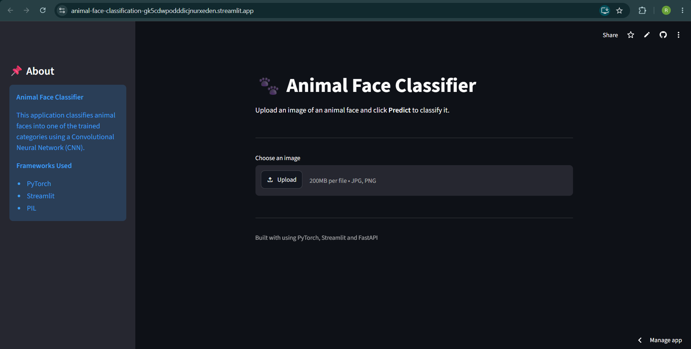
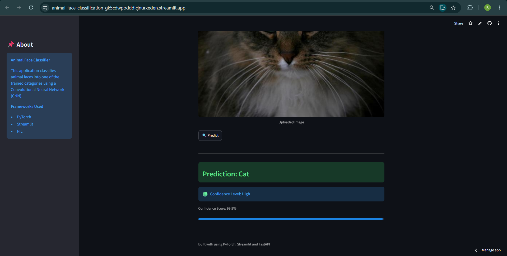
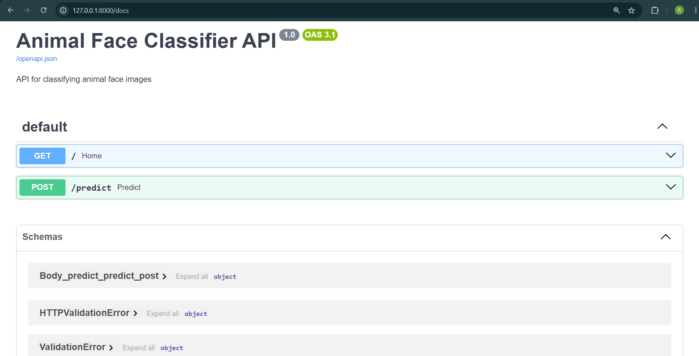
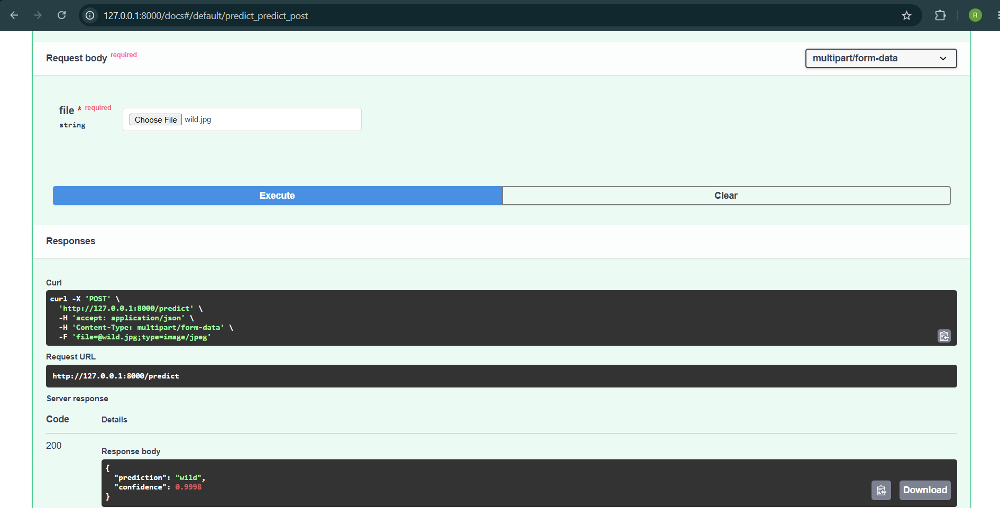

# 🐾 Animal Face Classifier

An end-to-end Deep Learning project that classifies animal face images into one of three categories: **Cat**, **Dog**, or **Wild** using a Convolutional Neural Network (CNN) built with **PyTorch**.

The project demonstrates a complete machine learning workflow—from model training and inference to API development, containerization, and deployment.

---

## 🚀 Live Demo

**Streamlit Application**

https://animal-face-classification-gk5cdwpodddicjnurxeden.streamlit.app/

---

## ✨ Features

- Classifies animal face images into:
  - 🐱 Cat
  - 🐶 Dog
  - 🦊 Wild
- Custom CNN built using PyTorch
- Real-time image classification
- Confidence score for every prediction
- Interactive Streamlit web interface
- FastAPI REST API backend
- Docker & Docker Compose support
- Modular and production-ready project structure

---

## 🛠️ Tech Stack

### Deep Learning

- PyTorch
- TorchVision
- NumPy
- Scikit-learn

### Backend

- FastAPI
- Uvicorn

### Frontend

- Streamlit

### Deployment

- Streamlit Community Cloud
- Docker
- Docker Compose

### Utilities

- Pillow
- Joblib

---

## 📂 Project Structure

```text
Animal-Face-Classification/
│
├── app.py
├── api.py
├── model.py
├── predict.py
│
├── models/
│   ├── best_model.pth
│   └── label_encoder.pkl
│
├── notebooks/
│
├── sample_images/
│
├── screenshots/
│   ├── home.png
│   ├── prediction.png
│   ├── swagger-ui-1.png
│   └── swagger-ui-2.png
│
├── Dockerfile
├── docker-compose.yml
├── requirements.txt
├── README.md
```

---

## 🧠 Model Pipeline

1. Load the trained CNN model.
2. Preprocess the uploaded image.
3. Perform model inference.
4. Calculate confidence score.
5. Display the predicted class and confidence.

---

## 📸 Screenshots

### Home Page



---

### Prediction Result



---

### FastAPI Swagger UI

Interactive API documentation.



---

### API Prediction Example

Prediction through the FastAPI endpoint.



---

## 💻 Running Locally

### Clone Repository

```bash
git clone https://github.com/<YOUR_USERNAME>/Animal-Face-Classification.git

cd Animal-Face-Classification
```

### Create Virtual Environment

```bash
python -m venv .venv
```

### Activate Environment

**Windows**

```bash
.venv\Scripts\activate
```

**Linux/macOS**

```bash
source .venv/bin/activate
```

### Install Dependencies

```bash
pip install -r requirements.txt
```

---

## ▶️ Run Streamlit

```bash
streamlit run app.py
```

---

## 🌐 Run FastAPI

```bash
uvicorn api:app --reload
```

Swagger documentation will be available at

```
http://127.0.0.1:8000/docs
```

---

## 🐳 Docker

Run the complete application using Docker Compose.

```bash
docker compose up --build
```

This launches:

- Streamlit frontend
- FastAPI backend

---

## 📊 Model Information

- **Framework:** PyTorch
- **Model:** Custom Convolutional Neural Network (CNN)
- **Dataset:** AFHQ (Animal Faces HQ)
- **Classes:**
  - Cat
  - Dog
  - Wild

---

## 📌 Deployment Notes

The repository includes both a **Streamlit frontend** and a **FastAPI backend**.

The live application is deployed on **Streamlit Community Cloud**, where predictions are performed using direct model inference.

The FastAPI backend remains fully implemented and can be executed locally or through Docker. Interactive API documentation is available through Swagger UI.

During deployment, the FastAPI service was initially tested on the Render free tier. However, the available **512 MB RAM** was insufficient to load the trained PyTorch model, resulting in memory-related startup failures. To provide a stable public demo, the deployed application uses direct inference while retaining the complete FastAPI implementation within the project.

---

## 🚀 Future Improvements

- Transfer Learning (ResNet / EfficientNet)
- ONNX or TorchScript optimization
- Batch image prediction
- Grad-CAM visualizations
- Additional animal classes
- Cloud deployment of the FastAPI backend using a higher-memory hosting service

---

## 👨‍💻 Author

**Rishit Mahindru**